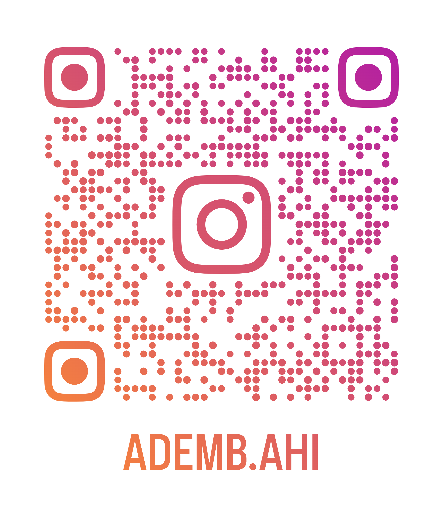

<div align="center">

# 👋 Hey, I'm Mohamed Ait

### 📱 Mobile Developer • 🎮 Game Developer • 🐍 Python Developer • 🎥 Content Creator

**I build things, learn fast, and turn ideas into working products.**

<br>

<a href="YOUR_GITHUB_LINK">
  
</a>
<a href="YOUR_INSTAGRAM_LINK">
  
</a>

</div>

---
---

# 👥 Meet My Team

<div align="center">

<table>
<tr>

<td align="center" width="33%">


### 📱 Mohamed Ait

**Mobile Developer**

Flutter • Dart • UI/UX

</td>

<td align="center" width="33%">


### 🎬 Amine

**Senior Video Editor**

Video Editing • Visual Content

</td>

<td align="center" width="33%">



### ⚙️ Ademb.Ahi

**Junior Backend Developer**

Backend • APIs • Server

</td>

</tr>
</table>

### 📱 Mobile + ⚙️ Backend + 🎬 Video

**Different skills. One team.**

</div>

## 🚀 About Me

I'm a developer interested in more than just writing code.

My main focus is **mobile development**, but I've also built games, worked with Python automation, participated in hackathons, designed interfaces, created content, and worked with development teams.

I enjoy taking an idea from:

**💡 Idea → 🎨 Design → 💻 Development → 🧪 Testing → 🚀 Product**

I'm currently working toward becoming someone who can understand and contribute to the **whole product**, not just one part of it.

---

# 💻 What I Do

<table>
<tr>

<td width="50%" valign="top">

## 📱 Mobile Development

### Junior Mobile Developer

My main development focus is mobile applications.

**Technologies & concepts I work with:**

- Flutter
- Dart
- REST APIs
- Provider
- Repository Pattern
- Use Cases
- Dependency Injection
- Authentication
- Local Storage
- Localization
- Maps & Location
- UI/UX implementation

I'm currently focused on improving my ability to build **real-world, production-oriented applications**.

</td>

<td width="50%" valign="top">

## 🎮 Game Development

### Game Developer

Game development is one of my strongest areas.

**I work with:**

- Godot Engine
- Gameplay systems
- Game mechanics
- Game prototyping
- Rapid development
- Game jams

### 🏆 SOP Game Jam

**20th place out of 480 participants**

One of my biggest achievements in game development.

</td>

</tr>
</table>

---

# 🏆 Achievements

### 📱 OMC — Sub Mobile Development Team Leader

One of my biggest achievements was becoming a:

**Sub Mobile Development Team Leader at OMC**

This gave me experience beyond programming:

- 🤝 Team collaboration
- 🧠 Problem solving
- 📋 Organizing development work
- 💬 Technical communication
- 👥 Working with other developers
- 🎯 Taking responsibility

---

### 🎮 SOP Game Jam — 20 / 480

Participated in the SOP Game Jam and achieved:

# 🏆 20th / 480

Working under a limited timeframe taught me how to quickly turn an idea into a playable product while working under pressure.

---

### 💻 5 Hackathons

I've worked as a **team member in 5 hackathons**.

These experiences helped me improve:

- Teamwork
- Communication
- Rapid prototyping
- Problem solving
- Working under deadlines
- Turning ideas into working solutions

---

### 🐍 OMC — Python Automation

I was part of a team that built an **automated professional email system for OMC using Python**.

This gave me practical experience with:

- Python
- Automation
- Software development
- Team collaboration
- Building solutions for real use cases

---

# 🐍 Python

I also work with Python for:

- Automation
- Scripting
- Application logic
- Problem solving
- Team-based projects

My most notable Python experience so far was contributing to the **OMC professional email automation system**.

---

# 🎨 Design & Creative

I believe developers benefit from understanding design.

I work with:

- 🎨 Figma
- 🖌️ Canva
- 🎬 CapCut
- 📱 UI/UX
- 🎥 Content creation
- 📢 Personal branding

I use design tools to communicate ideas, prototype interfaces, and create content around the things I build.

---

# 🛠️ Tools I Use

### 💻 Development

<p align="center">


</p>

### 🎨 Design & Content

<p align="center">


</p>

### 🎬 Other Tools

<p align="center">

`CapCut` • `VS Code` • `Figma` • `Canva` • `Godot` • `GitHub` • `Other IDEs`

</p>

---

# 👥 My Team

I work with a small team of **three people**, each with a different main skill.

<div align="center">

<table>
<tr>

<td align="center" width="33%">

### 📱 Mobile


### Mohamed Ait

**Mobile Developer**

Flutter • Dart • UI/UX

</td>

<td align="center" width="33%">

### 🎬 Video


### Amine

**Senior Video Editor**

Video Editing • Visual Content

</td>

<td align="center" width="33%">

### ⚙️ Backend


### Ademb.Ahi

**Junior Backend Developer**

Backend • APIs • Server Development

</td>

</tr>
</table>

</div>

---

## 🧩 Three Skills. One Team.

<div align="center">

### 📱 Mobile + ⚙️ Backend + 🎬 Video

**Different skills. One team.**

</div>

```text
                         💡 IDEA
                           │
                           ▼
                  ┌─────────────────┐
                  │     OUR TEAM    │
                  └─────────────────┘
                     │      │      │
                     ▼      ▼      ▼
                    📱     ⚙️     🎬
                  MOBILE BACKEND VIDEO
                     │      │      │
                     └──────┼──────┘
                            ▼
                         🚀 PRODUCT
