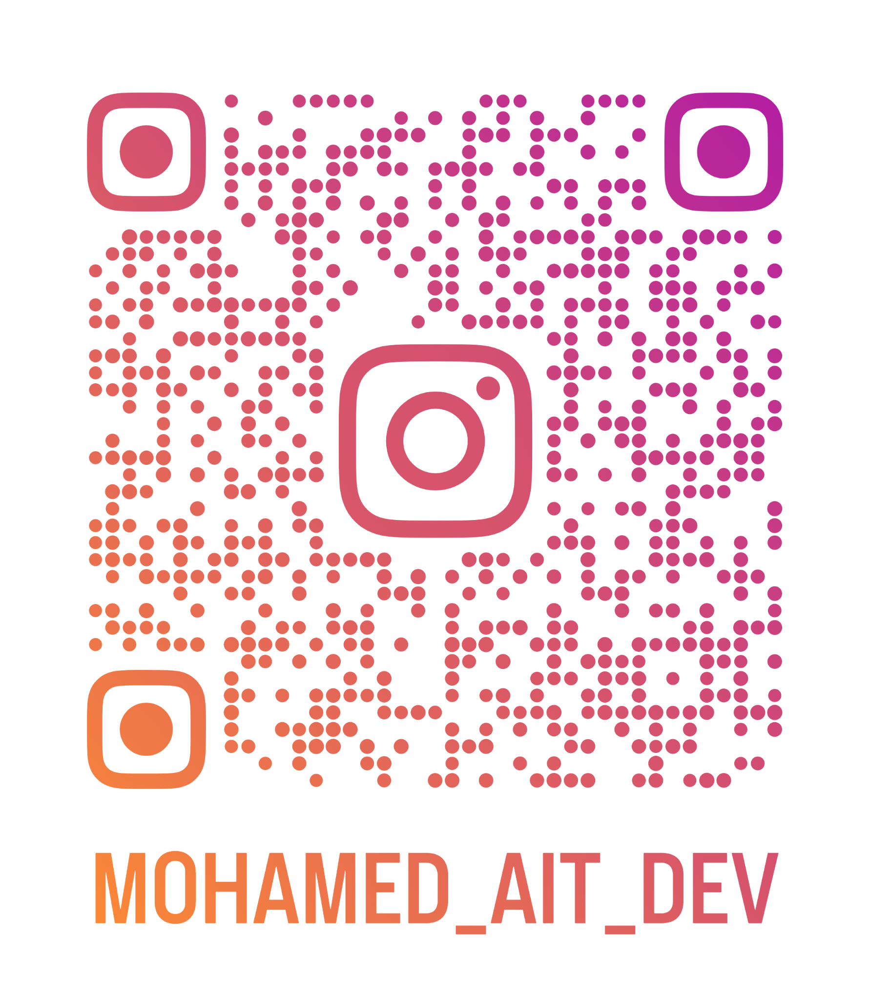

# Mohamed Ait Dev

  

  <b>Mobile Developer • Game Developer • Python Developer • Team Player • Content Creator</b>

  I build mobile experiences, games, automation systems, and digital products — while growing teams and turning ideas into working projects.

---

## 👋 About Me

I'm a **junior front-end / mobile developer** with hands-on experience building Flutter applications, a **game developer** focused on Godot, and a Python developer interested in automation and practical systems.

I enjoy working where **development, design, teamwork, and content creation** meet.

### 🏆 Highlights

- 👨‍💻 **Sub-Mobile Development Team Leader — OMC**
- 🎮 **Ranked 20th out of 480 in the SOP Game Jam**
- 🐍 Worked as part of a team to build an **automated professional email system for OMC**
- 🤝 Worked as a teammate across **5 hackathons**
- 🚀 Building real-world software projects with a small multidisciplinary team

---

## 🛠️ Skills

### 📱 Mobile & Front-End Development

- Flutter & Dart
- Responsive UI development
- State management
- REST API integration
- Repository Pattern / layered architecture
- Dependency Injection
- Localization & RTL support
- Map-based applications
- Authentication flows
- Local data persistence
- Debugging & performance-oriented development

### 🎮 Game Development

- Godot Engine
- Gameplay programming
- Game systems
- Prototyping
- Game jam development
- Rapid iteration under deadlines

**Achievement:** 🏆 Ranked **20 / 480** in the SOP Game Jam.

### 🐍 Python

- Python development
- Automation
- Scripting
- Practical system development

**Project experience:** Worked with a team on an **automated professional email system for OMC**.

### 🤝 Teamwork & Leadership

- Sub-Mobile Development Team Leader at OMC
- Team collaboration across **5 hackathons**
- Comfortable working with developers, designers, and creative specialists
- Task coordination and deadline-driven development

---

## 🧰 Tools I Work With

| Category | Tools |
|---|---|
| 💻 Development | VS Code, other IDEs |
| 📱 Mobile | Flutter, Dart |
| 🎮 Game Development | Godot |
| 🎨 UI / Design | Figma, Canva |
| 🎬 Video / Content | CapCut |
| 🔧 Workflow | Git, GitHub |

---

## 👥 My Team

I also work with a small team of **3 members**:

- 👨‍💻 **Me** — Mobile / Front-End Developer & Game Developer
- ⚙️ **Junior Backend Developer** — Backend development & APIs
- 🎬 **Senior Video Editor** — Video editing & visual content

Together, we can cover much more than development alone — from **product idea → design → development → backend → content**.

---

## 🚀 What I Can Build

- 📱 Flutter mobile applications
- 🗺️ Map & location-based applications
- 🔐 Authentication systems
- 🔌 API-connected applications
- 🎮 Games and interactive prototypes
- 🐍 Python automation tools
- 🎨 UI implementations from Figma designs
- 🤖 AI-powered application features
- 📦 MVPs and prototypes for ideas and startups

---

## 📚 Current Focus

I'm focused on becoming a stronger **product-oriented developer** — not only writing code, but understanding how products are designed, marketed, presented, and turned into real businesses.

My direction combines:

**Development + Design + AI + Marketing + Content + Business**

---

## 📸 Connect With Me

Scan the QR code above to visit my Instagram.

  
  

---

## ⚡ Philosophy

> **Build. Learn. Ship. Improve.**

I believe the fastest way to grow is to work on real projects, collaborate with real people, make mistakes, and keep shipping.

---

  <i>Thanks for visiting my profile.</i>

