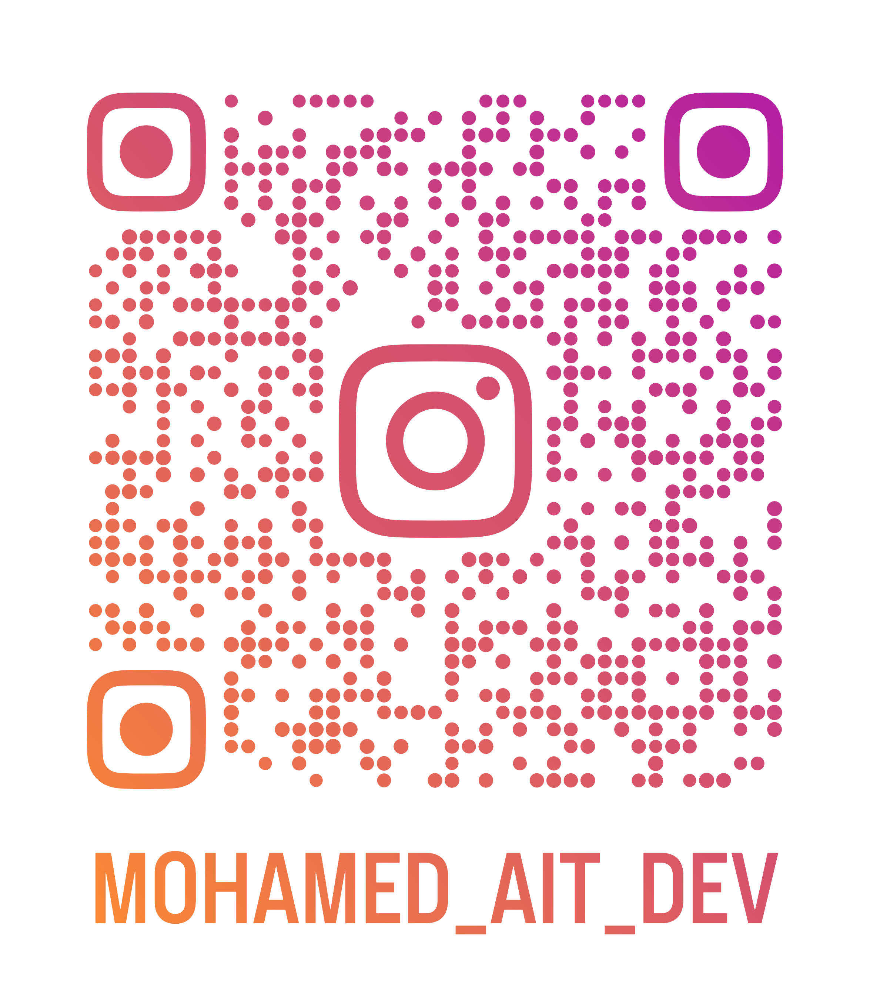
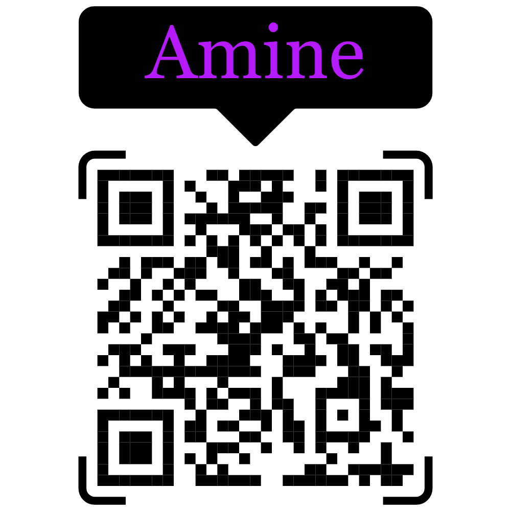

# 📱 Mobile Developer

### I build mobile applications, digital products & interactive experiences.

 

&nbsp;

  

---

## 👥 THE TEAM

### Different specialties. One team.

 

<table>
<tr>

<td align="center" width="33%">

 

### Mohamed Ait

**📱 Mobile Developer**

Flutter · Dart · Python

 

</td>

<td align="center" width="33%">

 

### Amine

**🎬 Senior Video Editor**

Video Editing · Content

 

</td>

<td align="center" width="33%">

 

### Backend Developer

**⚙️ Junior Backend Developer**

Backend · APIs · Systems

 

</td>

</tr>
</table>

---

# 🚀 WHAT I DO

<table>
<tr>

<td width="50%" align="center">

## 📱 Mobile Development

I build cross-platform applications with **Flutter**, focusing on clean architecture, reusable components, API integration and real-world product development.

</td>

<td width="50%" align="center">

## 🎮 Game Development

I build games and interactive experiences using **Godot** and **Python**, with a strong focus on gameplay and player experience.

</td>

</tr>

<tr>

<td width="50%" align="center">

## 🐍 Python

Automation, scripting and software development.

One of my OMC team projects involved building an **automated professional email system**.

</td>

<td width="50%" align="center">

## 🤝 Teamwork

I've worked as a teammate across **5 hackathons** and have experience taking responsibility inside development teams.

</td>

</tr>
</table>

---

# 🏆 ACHIEVEMENTS

 

<table>
<tr>

<td align="center" width="33%">

<h2>🥇 20 / 480</h2>

<b>SOP Game Jam</b>

  

Ranked **20th out of 480**

 

Senior Game Developer

</td>

<td align="center" width="33%">

<h2>👥 Team Leader</h2>

<b>OMC</b>

  

Sub Mobile Development  
Team Leader

</td>

<td align="center" width="33%">

<h2>⚡ 5 Hackathons</h2>

<b>Team Experience</b>

  

Worked as a developer  
across 5 hackathons

</td>

</tr>
</table>

---

# 🛠️ TECH STACK

### 📱 Mobile Development

  

### 🐍 Programming

  

### 🎮 Game Development

  

### 🎨 Design & Content

  

### 💻 Development Tools

  

---

# 🧠 MY DEVELOPMENT APPROACH

 

<table>
<tr>

<td align="center">

### 🎯 PRODUCT

I don't just build interfaces.

I build products around real problems.

</td>

<td align="center">

### 🧩 ARCHITECTURE

Repository Pattern  
Use Cases  
Dependency Injection  
Clean separation

</td>

<td align="center">

### 🤝 COLLABORATION

Hackathons  
Team projects  
Leadership  
Communication

</td>

</tr>
</table>

---

# 🚗 FEATURED PROJECT

### A Flutter ride-hailing application

 

**Waslini** is a ride-hailing mobile application built around a map-centric
experience with authentication, ride preview, booking infrastructure,
routing and repository-based architecture.

 

  

**Architecture**

`UI → Controller → UseCase → Repository → Data / API`

---

# 🎨 CREATIVE SIDE

<table>
<tr>

<td align="center">

 

<b>Figma</b>

UI / UX Design

</td>

<td align="center">

 

<b>Canva</b>

Branding & Graphics

</td>

<td align="center">

 

<b>Godot</b>

Game Development

</td>

<td align="center">

 

<b>VS Code</b>

Development

</td>

<td align="center">

 

<b>CapCut</b>

Content

</td>

</tr>
</table>

---

# 📊 GITHUB

 

  

---

# 📬 LET'S BUILD SOMETHING

### Have an idea?

### Let's turn it into a product.

 

  

